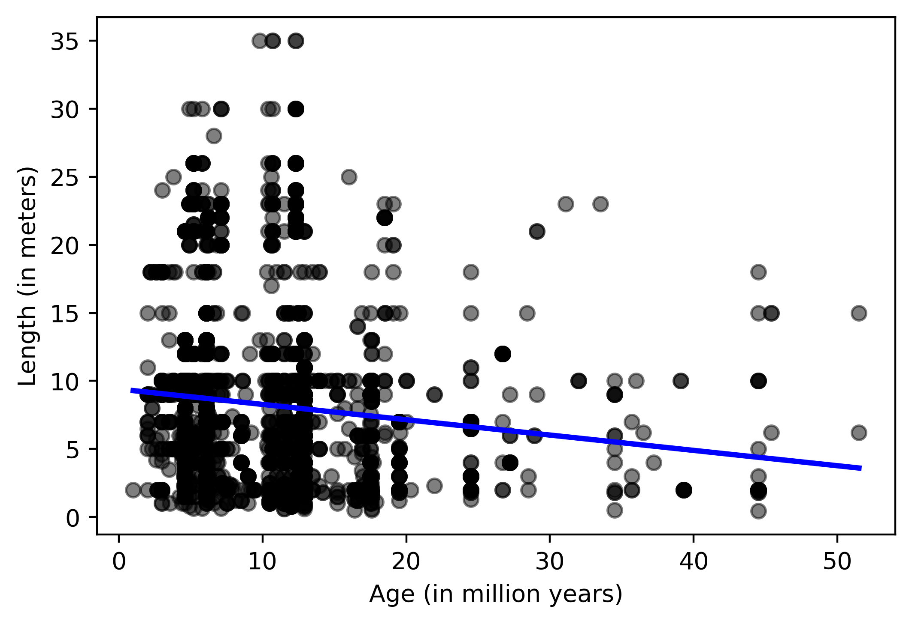

# Project: The Analysis of Dinosaur Fossils

## Data
- Information on dinosaur fossils with broad features like size or location
- Source: DataCamp

## Strategy
- <b>Descriptive analysis</b> to address the following questions:
    - How many different dinosaur names are present in the data?
    - Which was the largest dinosaur? What about missing data in the dataset?
    - What dinosaur type has the most occurrences in this dataset? 
    - Did dinosaurs get bigger over time?
    - Interactive map of fossil records

## Analysis

### How many different dinosaur names are present in the data?

<figure>
    
    <figcaption><em><small>Number of dinosaurs by diet</small></em></figcaption>
</figure>


Surprisingly, relatively few dinosaurs are omnivorous, i.e., consume plants and animals.

### Which was the largest dinosaur? What about missing data in the dataset?

```python
max_length = dinosaurs["length_m"].max()

largest_dinosaur = dinosaurs[
    dinosaurs["length_m"] == max_length
]["name"].unique()

for name in largest_dinosaur:
    print(name)
```

There are actually 2 dinosaurs that can claim the title of the largest dinosaur: <b>Supersaurus</b> and <b>Argentinosaurus</b>. Both are recorded with a maximum length of <b>35 meters</b>(from head to tail). This, of course, only holds for the recorded dinosaurs (see below with respect to missing information).

<figure>
    
    <figcaption
    style="font-size:14px; color:gray; text-align:center;">Distribution of length (in m)</figcaption>
</figure>

The bulk of dinosaurs is actually smaller than 10 meters.

#### What about missing data?

```python
missing_lengths = dinosaurs[dinosaurs["length_m"].isna()]
missing_lengths_count = missing_lengths["name"].nunique()
missing_lengths_perc = (missing_lengths_count / n_dinos) * 100

print(
    f"""
    There are {missing_lengths_count} or {round(missing_lengths_perc, 1)}%
    dinosaurs for which no length was recorded.
    """
)
```

With 72% of the dinosaurs having no length information, it could be that the largest dinosaurs is actually not recorded, i.e. has missing information.

Another issue is sample selection. The data set only contains the recorded, i.e. the discovered fossils. It is possible that the largest dinosaur has not been discovered yet.

### What dinosaur type has the most occurrences in this dataset?

<figure>
    
    <figcaption
    style="font-size:14px; color:gray; text-align:center;">Number of occurence by type</figcaption>
</figure>

Ornithopods appear the most in the data followed by theropods.

### Did dinosaurs get bigger over time?

<figure>
    
    <figcaption
    style="font-size:14px; color:gray; text-align:center;">Number of occurence by type</figcaption>
</figure>

There is a decreasing relationship between the age of the fossil and the its length. However, this does not necessarily mean that the dinosaurs got smaller. It could be a sample selection in the fossils.

### Interactive map of fossil records

```python
interactive_map = px.scatter_geo(
    dinosaurs,
    lat = "lat",
    lon = "lng",
    hover_name = "occurrence_no",
    color = "length_m",
    labels={"length_m": "Length (in m)"}
)

interactive_map.update_geos(
    projection_type = "natural earth"
)

# show map
plot(interactive_map)
```
<figure>
    
    <figcaption
    style="font-size:14px; color:gray; text-align:center;">Screenshot of interactive map</figcaption>
</figure>

[Interactive Fossil Length Map](https://github.com/PThie/Analysis-Dinosaurs/blob/main/output/graphs/interactive_fossil_length_map.html)

### Difference between size and diets

<figure>
    
    <figcaption
    style="font-size:14px; color:gray; text-align:center;">Boxplot of dinosaur length by diet</figcaption>
</figure>

Herbivorous dinosaurs seem to be larger than the other dinosaur types. Their median length, as well as Q1 and Q3, are larger than those of carnivorous and omnivorous dinosaurs. This is interesting because a plant-based diet is harder to process and provides less energy. So herbivorous dinosaurs have to eat a lot more (in volume) to get that big. Carnivorous dinosaurs have an advantage in this category. However, plants are widely available compared to meat, so they can be easily consumed, so eating large amounts is not a challenge.
